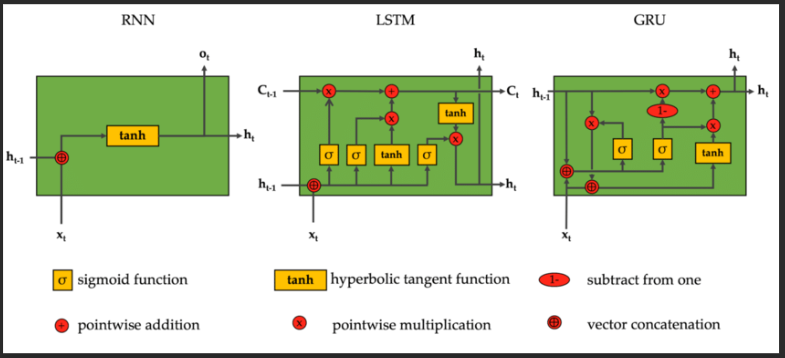

# Repositorio Procesamiento del Lenguaje Natural (NLP) 
## Autor: Pablo Segovia

# Resumen
El presente repositorio describe los trabajos realizados sobre diferentes temas de Procesamiento del Lenguaje Natural (NLP).

1. Similitud con vectorización de texto [🧬](https://github.com/manoloacademia/CEIA_NLP/blob/main/Desafio_1_PabloSegovia.ipynb)
2. Generación de embeddings sobre Crímen y Castigo [⛓️](https://github.com/manoloacademia/CEIA_NLP/blob/main/Desafio_2_PabloSegovia.ipynb)
3. Modelos de lenguaje basados en arquitecturas recurrentes 
4. Chatbot Q&A con LSTM 
5. Clasificador con BERT como encoder [⭐](https://github.com/manoloacademia/NLP/blob/main/Desafío_5_PabloSegovia.ipynb)

# Detalle de cada trabajo

## Trabajo 1: similitud con vectorización de texto

- El [Trabajo 1](https://github.com/manoloacademia/CEIA_NLP/blob/main/Desafio_1_PabloSegovia.ipynb) soluciona un problema de similitud realizando una vectorización de texto y modelo de clasificación Naïve Bayes con el dataset [20 newsgroups](https://scikit-learn.org/0.19/datasets/twenty_newsgroups.html).
- Para poder resolverlo, se utilizó un vectorizador del tipo [``TfidfVectorizer()``](https://scikit-learn.org/stable/modules/generated/sklearn.feature_extraction.text.TfidfVectorizer.html) para hacer la extracción de features.
- Se estudió la similaridad de los documentos utilizando la similaridad del coseno como medida de la similitud existente entre dos vectores en un espacio.
- Se entrenaron modelos de clasificación Naïve Bayes Multinomial y ComplementNB para maximizar el desempeño de clasificación (f1-score macro).
- Se estudió también transponer la matriz documento-término, para obtener una matriz término-documento que puede ser interpretada como una colección de vectorización de palabras.
- Se encontró que con el número de features original (vocabulario 101631) muchas de las palabras dentro del diccionario son palabras que no forman parte del vocabulario Inglés persé, sino palabras que quedaron dentro del vocabulario del texto como "malos tokens".
- Se encontró que incluso bajando el número de features tenemos estas palabras pero en menor proporción.
- Al final yendo con 10.000 palabras, si bien el resultado de las similares son palabras del inglés, no existe mucha similaridad contextual entre ellas.

## Trabajo 2: generación de embeddings sobre Crímen y Castigo

- El [Trabajo 2](https://github.com/manoloacademia/CEIA_NLP/blob/main/Desafio_2_PabloSegovia.ipynb) es utilizar documentos / corpus para crear embeddings de palabras basado en ese contexto.
- Se utilizó el libro [Crimen y Castigo de Fiódor Dostoievski](https://www.gutenberg.org/ebooks/61851) para generar los embeddings, es decir, que los vectores tendrán la forma en función de como ese libro haya sido escrito.
- Generamos nuestros propios vectores de embedding [Gensim](https://www.machinelearningplus.com/nlp/gensim-tutorial/).
- Se entrenó un modelo Word2Vec utilizando la estructura modelo Skipgram.
- Se trató de explicar los personajes de la novela buscando las palabras similares con embeddings más cercanos. Dejo la fuente de referencia de la novela en este [link](https://es.wikipedia.org/wiki/Crimen_y_castigo#Personajes).
- Se trató también de explicar las partes del libro por las palabras similares de la idea general de cada parte.
- Podemos decir que usando este método Word2Vec, los embeddings de los personajes tienen relación semántica con las palabras similares.
- Al poder graficarlos, vemos que reduciendo dimensionalidad a 2D, tenemos la posibilidad de ubicar tanto nombre y apellido de un personaje como puntos cercanos del plano.
- Podemos agregar que buscando tan solo 1 palabra en cada una de las partes del libros, se puede apreciar la similitud en varias palabras con el contexto de lo que realmente pasa en el libro. Así, la similitud semántica es aparente.
- Al buscar el título del libro dentro del texto en cuestión, vemos que también hay mucha similitud con las palabras que son ajenas al text. Estas palabras forman parte del detalle de propaganda y descripción del Proyecto Gutenberg. De esta forma, se abre una opotunidad para chequear y "filtrar" este tipo de palabras del corpus.

## Trabajo 3: modelos de lenguaje basados en arquitecturas recurrentes

- El [Trabajo 3](https://github.com/manoloacademia/CEIA_NLP/blob/main/Desaf%C3%ADo%203_PabloSegovia.ipynb) describe entrenar un modelo de lenguaje basado en arquitectura recurrente.
- Se utiliza el corpus [A Million News Headlines](https://www.kaggle.com/datasets/therohk/million-headlines/data) que contiene la data de encabezados de noticias de la ABC Australiana en los últimos 19 años.
- El objetivo principal sería lograr que durante el entrenamiento baje la [perplejidad](https://medium.com/nlplanet/two-minutes-nlp-perplexity-explained-with-simple-probabilities-6cdc46884584). Este concepto permite comparar modelos.
- Se exploraron diferentes modelos buscando este objetivo: LSTM, Conv1D y Bidirectional LSTM, Bidirectional LSTM stack, Conv1D stack, Bidirectional LSTM y GRU, Aumento de neuronas, Cambio de size del contexto máximo y Cambio del tamaño del corpus.
- Si bien nunca se pudo generar durante el entrenamiento que la perplejidad sea menor luego de cada época, se tiene un valor bajo al ir puliendo la arquitectura del modelo.
- Se realiza una generación de secuencias random y usando beam search con buen resultado.

## Trabajo 4: chatbot Q&A con LSTM

- El [Trabajo 4](https://github.com/manoloacademia/CEIA_NLP/blob/main/Desaf%C3%ADo_4_PabloSegovia.ipynb) describe realizar un Bot de Q&A usando un modelo LSTM.
- Se basa en un dataset del challenge ConvAI2 [Conversational Intelligence Challenge 2](https://convai.io/data/) y en él tratamos de responder las preguntas del usuario.
- Se realiza un preprocesamiento necesario para obtener los diccionarios de índices para los tokens, tanto entrada como salida.
- Se utilizaron los embedding de [Glove](https://nlp.stanford.edu/projects/glove/) para transformar los tokens de entrada en vectores.
- Se entrena un modelo basado en el esquema encoder-decoder utilizando los datos generados.
- Se genera inferencia del modelo y se obtiene un buen nivel de coherencia en las respuestas, aunque no se pueda generar una respuesta directa.
- Para poder mejorar el modelo haría falta poder consumir todo el dataset y todo el vocabulario, pero la cantidad de RAM no es suficiente con los medios disponibles gratuitos y locales.

## Trabajo 5: clasificación con BERT como encoder

- El [Trabajo 5](https://github.com/manoloacademia/NLP/blob/main/Desafío_5_PabloSegovia.ipynb) describe entrenar un modelo ed clasificación de [Sentiment Analysis](https://huggingface.co/blog/sentiment-analysis-python) para un dataset de reviews de apps utilizando el modelo [BERT](https://huggingface.co/docs/transformers/model_doc/bert) como encoder.
- 

## Contacto
Pueden escribirme directamente a mi dirección de mail: 📫 luispablosegovia@icloud.com 

O tal vez directamente a mi LinkedIn 

Y pasear por mis repositorios en Github [:octocat:](https://github.com/manoloacademia?tab=repositories)

Saludos!

### Licencia: MIT
